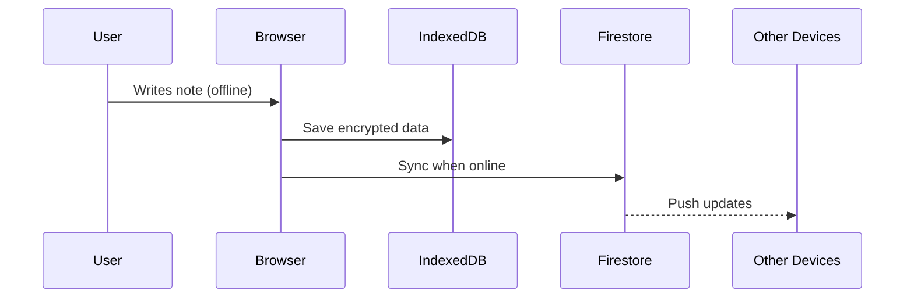

# FocusFlow - Secure Notes & Todos (MVP)

**Goal**: Build a secure, shareable notes app with auth-first architecture to replace Apple Notes.

---

## **MVP Core Features**
### Priority 1: Authentication & Security
1. **Auth Providers**  
   - Google/Apple SSO  
   - Email/password  
   - Guest mode (local-only)  
2. **Access Control**  
   - Per-user data isolation  
   - Encrypted local storage (WebCrypto)  
3. **Session Management**  
   - JWT token refresh  
   - Biometric unlock (WebAuthn)  

### Priority 2: Notes Core
1. Rich text editor (TipTap)  
2. Nested folders/tags  
3. Instant search (Fuse.js)  

### Priority 3: Sharing
1. Share notes via link (view-only/edit)  
2. Guest collaboration  
3. Activity log  

---

## **Tech Stack**
### Auth Options
| **Provider** | Setup Time | Cost | Offline Support |  
|--------------|------------|------|-----------------|  
| **Firebase** | 1 hour | Free tier | ✅ |  
| **Supabase** | 1.5 hours | Free tier | 🟡 |  
| **Clerk** | 45 mins | Free tier | ❌ |  

### Chosen Stack
- **Auth**: Firebase (with offline fallback)  
- **DB**: Firestore + IndexedDB (Dexie.js)  
- **Editor**: TipTap  
- **Styling**: shadcn/ui + Tailwind  

---

## **Development Plan**
### Day 1: Auth + Base UI
```bash
# Install auth deps
npm install firebase @react-firebase/auth crypto-js
```
1. [ ] Auth flows (login/signup/profile)  
2. [ ] Data encryption setup  
3. [ ] Basic note list UI  

### Day 2: Editor + Sharing
1. [ ] Rich text editor implementation  
2. [ ] Share dialog with permissions  
3. [ ] Real-time collaboration  

### Day 3: Offline + Deploy
1. [ ] Service worker caching  
2. [ ] Conflict resolution logic  
3. [ ] Vercel deployment  

---

## **Data Flow**


---

## **Auth Implementation Snippet**
```tsx
// src/lib/auth.ts
import { initializeApp } from "firebase/app";
import { getAuth, GoogleAuthProvider } from "firebase/auth";

const firebaseConfig = { /* ... */ };
const app = initializeApp(firebaseConfig);
export const auth = getAuth(app);

// Google login
export const googleLogin = async () => {
  const provider = new GoogleAuthProvider();
  await signInWithPopup(auth, provider);
};

// Encrypt data before storage
const encryptData = (data: string, key: string) => {
  return CryptoJS.AES.encrypt(data, key).toString();
};
```

---

## **Why Auth First?**
1. **Data Isolation**: Friends won't see each other's notes  
2. **Security**: Encryption keys tied to user sessions  
3. **Sync Foundation**: User-aware conflict resolution  

---

## **Post-MVP Auth Upgrades**
1. Social sharing permissions  
2. Audit logs  
3. 2FA support  

---

This setup ensures you can safely share the app while maintaining Apple Notes' simplicity. Ready to code the auth flow first? 🛠️  
``` 
